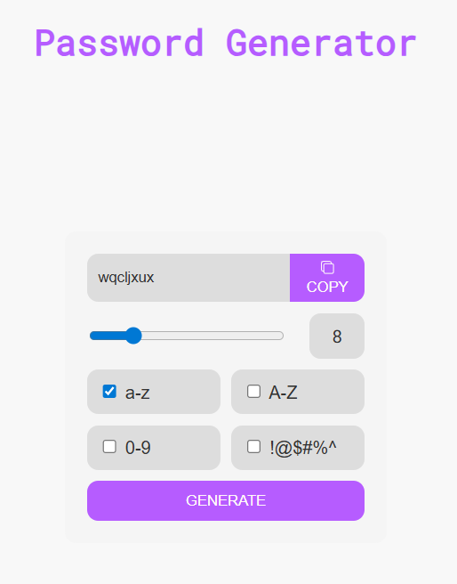

# 🔑 Password Generator

A secure and customizable **Password Generator** built with **HTML**, **CSS**, and **JavaScript**.  
Easily create strong passwords by choosing the length and character types you want to include.  

---

## ✨ Features
- 🔐 Generate strong, random passwords  
- 🔡 Choose between:
  - Uppercase letters (A–Z)  
  - Lowercase letters (a–z)  
  - Numbers (0–9)  
  - Symbols (!@#$%^&* etc.)  
- 📏 Adjustable password length  
- 📋 One-click copy to clipboard  
- 📱 Responsive and simple UI  

---

## 🛠 Tech Stack
| Technology | Purpose |
|------------|---------|
| **HTML5**  | Structure |
| **CSS3**   | Styling |
| **JavaScript** | Functionality & password logic |

---

## 🚀 Getting Started

### 1️⃣ Clone this repository
```bash
https://github.com/04ankit2002/Password-Generator
```
## 2️⃣ Run the app
  - Open index.html in your browser
  - Or use Live Server in VS Code

## 📸 Screenshots



## 🤝 Contributing
Pull requests are welcome! For major changes, please open an issue first to discuss what you’d like to change.
